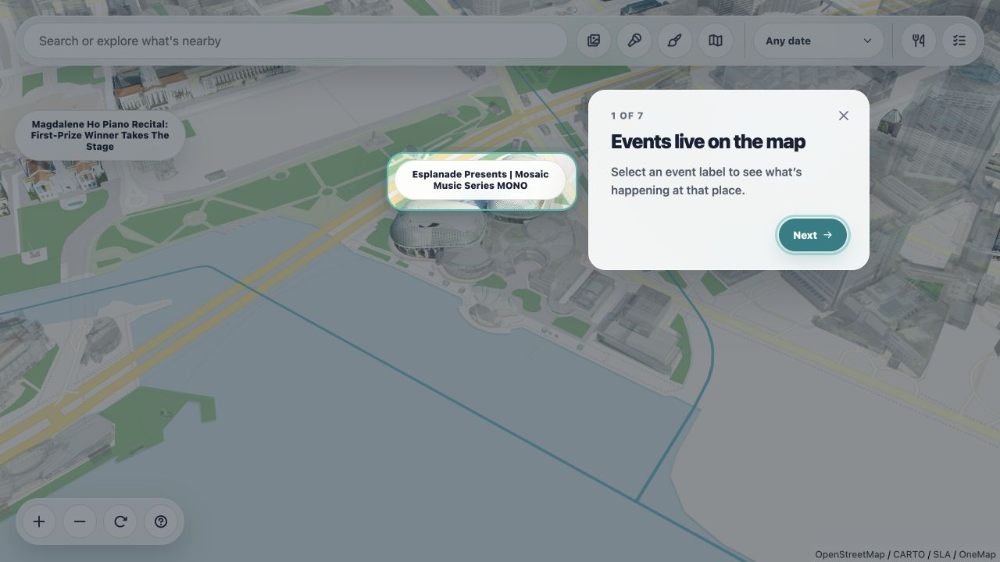

# Amble

Amble is a three-dimensional Singapore discovery map for finding events, nearby restaurants, and building an ordered day plan.



**Live demo:** https://amble.amble-sg.workers.dev

## What it does

- Renders Singapore building geometry with MapLibre, deck.gl, and 3D Tiles.
- Maps current events to verified OneMap building identities.
- Searches events by title, venue, category, and date.
- Discovers restaurants around the current viewport with cached fallback behavior.
- Builds ordered plans and exports routes to Google Maps.
- Publishes event updates through a staged, evidence-backed snapshot pipeline.

## Architecture

```text
Browser
  -> Cloudflare Worker
      -> Cloudflare R2 (3D tile geometry)
      -> Workers VPC -> Cloudflare Tunnel -> Node application/API
```

The repository intentionally contains tileset manifests but not the large `.b3dm` geometry files. Production geometry is stored in Cloudflare R2 so Git clones remain lightweight.

## Local development

Requirements:

- Node.js 24 or newer
- npm

```bash
npm ci
cp .env.example .env.local
npm run dev
```

Open http://127.0.0.1:5173. To load production 3D geometry while developing, set `TILE_FALLBACK_ORIGIN=https://amble.amble-sg.workers.dev` in `.env.local`.

## Validation

```bash
npm run build
npm run smoke:baseline
npm run verify
npm audit
```

`npm run verify` is the complete release gate: production build, Node contracts, source and artifact checks, browser coverage, production smoke testing, and the frontend performance contract.

## Repository map

- `activity-scenes/` — map interactions and product features
- `assets/` — editable source assets that are not shipped to browsers
- `map-layers/` — deck.gl and MapLibre building layers
- `scripts/` — server, data pipelines, publication, and operational tooling
- `cloudflare/` — public Worker and R2/VPC routing
- `data/` — approved immutable application snapshots and policies
- `pull_data.md` — executable event-source schedule and success ledger
- `tests/` — Node contract and Playwright browser tests
- `docs/` — architecture, deployment, operations, and design QA documentation
- `specs/` — product baseline, contracts, and implementation record

## Deployment notes

The current public deployment uses Cloudflare R2 for 3D geometry and a Workers VPC tunnel to the application origin. See [the deployment guide](docs/cloudflare-workers-vpc.md) for the exact request path and operational constraints.

Never commit populated `.env` files, Cloudflare credentials, Telegram tokens, administrator secrets, downloaded source geometry, or runtime databases.

## Data and licensing

The application source is currently all rights reserved. Third-party libraries and datasets retain their own licences. See [THIRD_PARTY_NOTICES.md](THIRD_PARTY_NOTICES.md) for attribution and data-use information.
